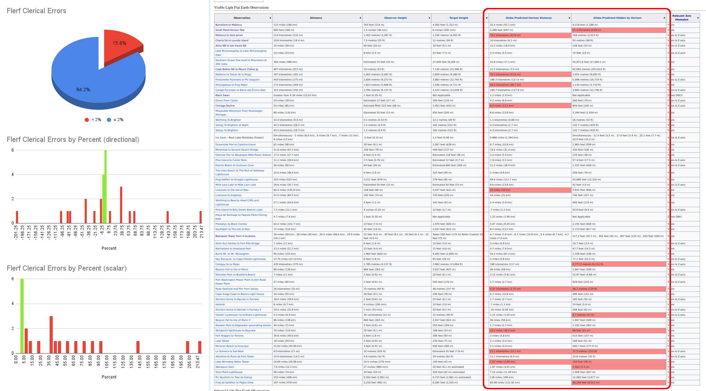
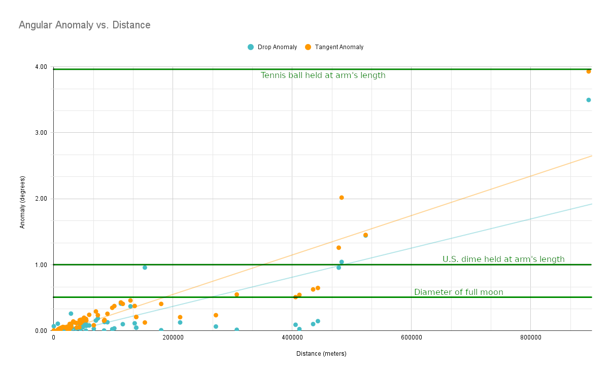

# “We see too far”
Recently a flat earther sent me [this](https://wiki.24-7flatearth.org/index.php/Observations), which for a moment almost impressed me. It's rare to see flat earthers attempt to compile their claims into any sort of structure, let alone quantitative data that invites analysis. I was delighted!

Naturally, [I took the invitation](https://docs.google.com/spreadsheets/d/1614xUuRNoZr0KGnNY4iYNGYuUyzvkEYw3ZyK6d2Oa9o/edit?usp=sharing). The data's quality was disappointing, but of course not surprising.

## Flerf Clerical Errors

The table made by flat earthers had two columns for "globe predictions," which were (supposedly) calculated from the data in the other columns. However, even taking the input numbers 100% completely on faith, I found dozens of clerical errors in the "globe prediction" columns. And not always small errors, either.



## Angular Anomaly

Of course, flat earthers love to use numbers that sound big, like "this mountain should be hidden by half a mile of curvature!"

But light doesn't care about distance: it cares about angles. So here are the _**alleged**_ anomalies (i.e. taking all their given measurements 100% on faith) but calculated as angular displacement in our eye and plotted with respect to distance:



## Using the Code

You will find two code files:
- `wiki_scrub.js`
- `process.php`

`wiki_scrub.js` is for extracting the tabulated data off the Wiki page into a CSV file for easier analysis. The steps are:
1. Open [the Wiki page](https://wiki.24-7flatearth.org/index.php/Observations) in a browser.
2. Open the browser's Javascript console.
3. Copy the file contents from `wiki_scrub.js` into the console. You may need to dismiss a security check.
4. It should now prompt you to download a CSV file.

I did some data cleanup and named the file `too_far-master.csv`. From there, you can open a terminal and run the PHP script:
```
php process.php
```
Voila! You should now have an output CSV file `too_far-processed.csv` that looks very much like [mine](https://docs.google.com/spreadsheets/d/1614xUuRNoZr0KGnNY4iYNGYuUyzvkEYw3ZyK6d2Oa9o/edit?usp=sharing).
